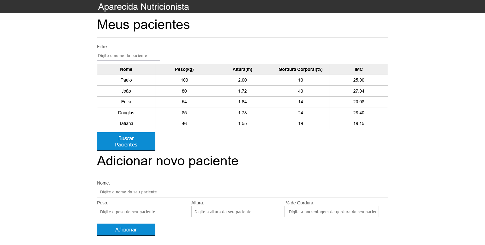

# Aparecida Nutrição
É um projeto desenvolvido nas aulas do curso "Javascript: Programando na linguagem da web" disponibilizado no site da Alura, mas alguns toques e
partes com edições feitas por mim.

  

 

  

## ✨ Tecnologias

Esse projeto foi desenvolvido com as seguintes tecnologias:
- [JavaScript](https://www.javascript.com/)

## 💻 Projeto

O Aparecida Nutrição é um app ficticio de uma clinica em que lista e calcula o IMC de seus pacientes em uma tabela.

## 🔖 Conceitos
- Manipulação de elementos DOM;
- Escutadores de eventos e formulários;
- Extração de funções e validação de formulários;
- Animações e Node;
- Filtros usando expressões regulares;
- Requisições utilizando Ajax;

## 🚀 Como executar

- Clone o repositório
- Abra o arquivo index.html

## 📄 Licença

Esse projeto está sob a licença MIT. Veja o arquivo [LICENSE](LICENSE.md) para mais detalhes.

---

Feito com ♥ by Ygor Takashi Nishi sobre orientação da empresa Alura
